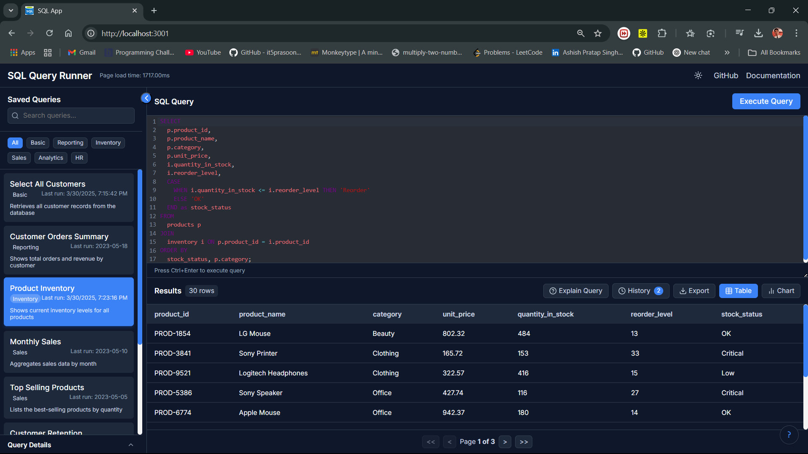
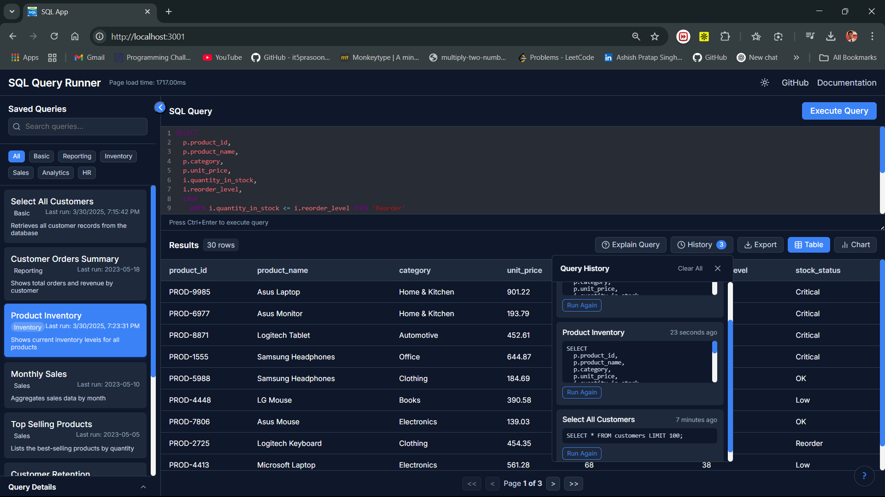
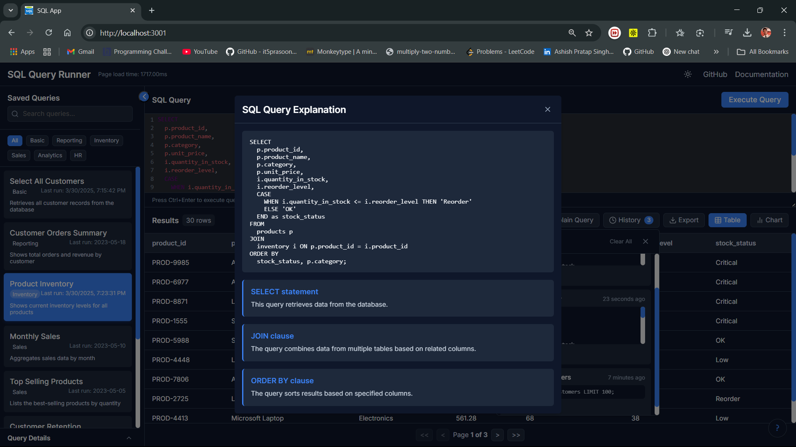
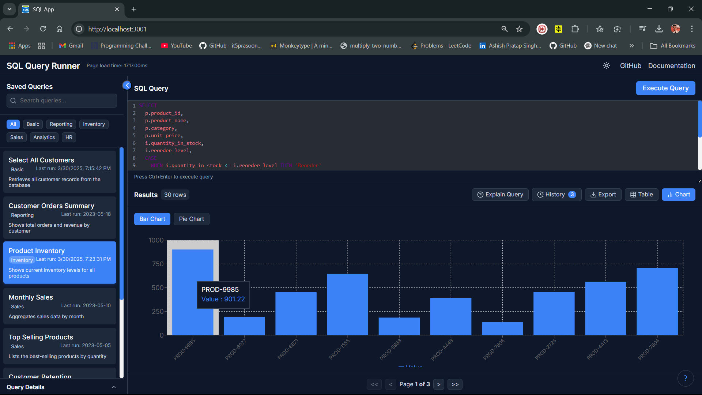
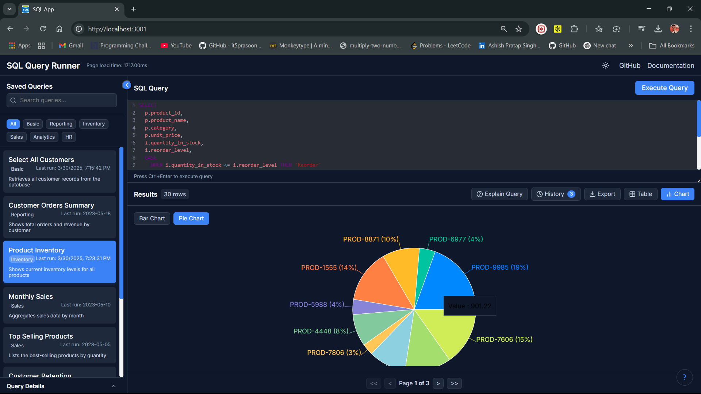
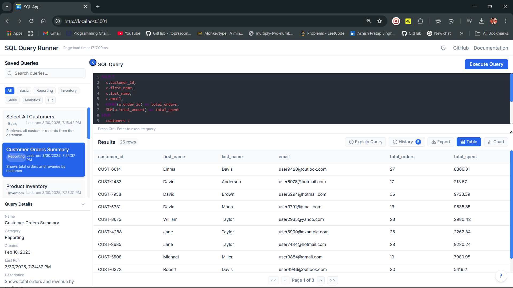

# SQL Query Runner 

A modern, interactive web application for running SQL queries and visualizing results in both tabular and chart formats.

## ✨ Features

- **Interactive SQL Editor** - Write and edit queries with syntax highlighting and auto-completion
- **Query Library** - Access and modify predefined queries for common tasks
- **Flexible Visualization** - View results as tables or interactive charts
- **Advanced Data Handling** - Sort, filter, and paginate through large result sets
- **Responsive Design** - Optimized for desktop and mobile devices

## 📸 Interface Showcase

Here's a visual journey through the platform's key interfaces:

### Login Page








## 🧩 Architecture

The application is built with a clean, component-based architecture using Next.js as the core framework:

```
sql-query-runner/
├── app/                  # Next.js app directory
├── components/           # Reusable React components
│   ├── enhanced-chart/   # Chart visualization components
│   ├── export-results/   # Export functionality
│   ├── header/           # Application header
│   ├── keyboard-shortcuts/ # Keyboard shortcuts functionality
│   ├── query-editor/     # SQL editor components
│   ├── query-history/    # Query history tracking
│   ├── query-info/       # Query metadata display
│   ├── query-selector/   # Query selection components
│   ├── results-table/    # Results display components
│   ├── sql-explainer/    # SQL explanation components
│   └── theme-toggle/     # Theme switching functionality
├── context/              # React context providers
├── hooks/                # Custom React hooks
├── lib/                  # Utility functions and helpers
├── public/               # Static assets
│   └── placeholder-*.png # Placeholder images
└── styles/               # Global styles
```

## 🚀 Technology Stack

### Core Framework
- **Next.js** - React framework for server-rendered applications

### UI Components and Styling
- **CSS Modules** - Component-scoped styling
- **Lucide React** - Modern icon library

### Data Handling and Visualization
- **CodeMirror** - Feature-rich text editor for SQL
- **TanStack Table** (React Table v8) - Powerful data table solution
- **Chart.js** - Flexible charting library

## ⚡ Performance Optimizations

The application implements several performance enhancements:

1. **Code Splitting** - Leverages Next.js built-in code splitting to reduce initial bundle size
2. **Virtualization** - Efficiently renders large datasets by only showing visible items
3. **Debouncing** - Reduces unnecessary re-renders for input-heavy operations
4. **Memoization** - Uses React's useMemo and useCallback to prevent redundant calculations
5. **Performance Monitoring** - Built-in load time tracking visible in the header

## 🧪 Query Examples

The application comes with several pre-defined queries to demonstrate functionality:

```sql
-- Sample query to fetch user activity
SELECT user_id, 
       COUNT(*) as total_queries, 
       AVG(execution_time_ms) as avg_execution_time
FROM query_logs
WHERE execution_date > DATE_SUB(NOW(), INTERVAL 7 DAY)
GROUP BY user_id
ORDER BY total_queries DESC
LIMIT 10;
```

## 🔧 Getting Started

### Prerequisites
* Node.js 16.x or higher
* npm or yarn package manager

### Installation
1. Clone the repository:
```bash
git clone https://github.com/yourusername/sql-query-runner.git
cd sql-query-runner
```

2. Install dependencies:
```bash
npm install # or yarn install
```

3. Run the development server:
```bash
npm run dev # or yarn dev
```

4. Open http://localhost:3000 in your browser to see the application.

## 📝 License

This project is licensed under the MIT License - see the LICENSE file for details.

## 🤝 Contributing

Contributions, issues, and feature requests are welcome! Feel free to check the issues page.